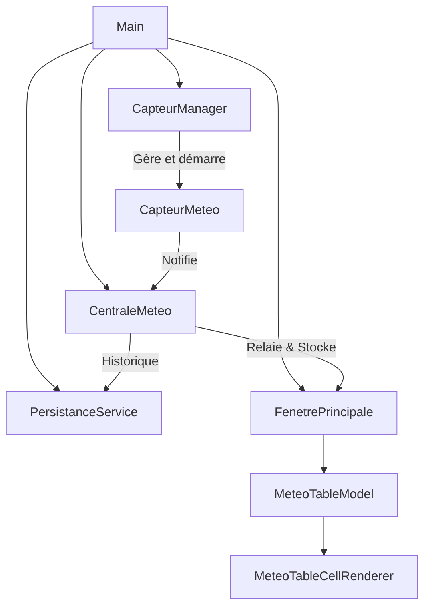

# Analyse Globale du Projet — AgriWatch (Supervision Météo & Alerte Agricole)

Ce document résume l'analyse complète de l'application **AgriWatch**, un projet pédagogique en Java (Swing) pour le cours **ICT308** de l'**Université de Yaoundé 1**.

---

## 1. Vue d'Ensemble & Fonctionnalités
AgriWatch est une application de supervision agricole en temps réel. Elle simule **5 capteurs météo** répartis sur 5 zones géographiques (`ZONE_A` à `ZONE_E`).
- **Objectif principal** : Surveiller la température et l'humidité de chaque zone.
- **Règle métier d'alerte** : Si l'humidité d'une zone descend en dessous de **30%**, une alerte d'irrigation est déclenchée (signal sonore + affichage clignotant + surbrillance rouge de la ligne dans le tableau).
- **Architecture** : Modèle-Vue-Contrôleur (MVC) couplé au pattern **Observer** et une gestion de threads concurrents.

---

## 2. Structure & Architecture Détaillée

Le code source est structuré de la manière suivante sous `src/main/java/cm/uy1/agriwatch/` :



### A. Le Noyau Métier (`core/`)
- **`Zone.java` (Enum)** : Définit les constantes des zones géographiques : `ZONE_A`, `ZONE_B`, `ZONE_C`, `ZONE_D`, `ZONE_E`.
- **`MeteoListener.java` (Interface)** : L'interface de callback pour l'Observer. Contient la signature :
  ```java
  void onMesureRecue(Zone zone, double temperature, double humidite);
  ```
- **`MesureMeteo.java` (POJO)** : Objet immutable modélisant une mesure. Implémente `Serializable` pour la persistance future. Contient :
  - `Zone zone`
  - `double temperature`
  - `double humidite`
  - `LocalDateTime timestamp` (généré à l'instanciation via `LocalDateTime.now()`)
- **`CapteurMeteo.java` (Runnable)** : Représente la tâche s'exécutant sur chaque thread capteur.
  - Génère de manière aléatoire la température (entre $15$ et $40$ °C) et l'humidité (entre $15$ et $85$ %).
  - Notifie ses observateurs (`listeners`) toutes les $2$ à $3$ secondes.
  - S'arrête proprement en attrapant `InterruptedException` et en restaurant l'état d'interruption du thread (`Thread.currentThread().interrupt()`).
- **`CentraleMeteo.java` (MeteoListener / Sujet)** : Agrégateur central de données.
  - Reçoit les mesures de chaque capteur en implémentant `MeteoListener`.
  - Enregistre chaque mesure dans une liste synchronisée : `Collections.synchronizedList(new ArrayList<>())`.
  - Redistribue les mesures aux abonnés enregistrés (comme l'interface graphique).

### B. Gestion des Threads (`threading/`)
- **`CapteurManager.java`** : Gère le cycle de vie des 5 threads associés aux zones.
  - `demarrer(MeteoListener listener)` : Crée un `CapteurMeteo` pour chaque zone, l'associe à la centrale (le listener), crée un `Thread` brut nommé (`Thread-ZONE_X`) et le démarre.
  - `arreter()` : Envoie une interruption à chaque thread (`Thread::interrupt`), attend leur terminaison via `join(3000)` (avec un timeout de 3 secondes) pour éviter des blocages infinis, puis nettoie les listes.
  - *Note d'évolution suggérée* : Remplacer l'utilisation brute de threads par un `ScheduledExecutorService`.

### C. Interface Graphique (`ui/`)
- **`MeteoTableModel.java` (AbstractTableModel)** : Modèle de données pour la table Swing.
  - Conserve la dernière mesure connue pour chacune des 5 zones actives dans une `List<MesureMeteo>`.
  - La méthode `mettreAJour(MesureMeteo)` remplace la mesure existante de la zone ou l'insère si elle est inédite, tout en notifiant Swing via `fireTableRowsUpdated` ou `fireTableRowsInserted`.
  - Fournit des méthodes utilitaires pour calculer en temps réel la température moyenne, l'humidité moyenne, le nombre de zones en alerte et vérifier l'état d'alerte d'une zone.
- **`MeteoTableCellRenderer.java` (DefaultTableCellRenderer)** :
  - Intercepte le rendu de chaque cellule du tableau.
  - Si l'humidité de la ligne est inférieure à **30%**, la couleur de fond devient rouge vif (`new Color(255, 80, 80)`) et le texte s'affiche en blanc.
  - Gère correctement la réinitialisation de la couleur lorsque l'humidité repasse au-dessus du seuil, évitant ainsi le piège classique de persistance de couleur dans Swing (règle du `else`).
- **`FenetrePrincipale.java` (JFrame & MeteoListener)** : L'IHM principale construite en `BorderLayout`.
  - **NORTH** : Affiche le titre en vert ("plantation") et une horloge temps réel rafraîchie toutes les secondes par un `javax.swing.Timer`. Un label d'alerte clignotant rouge (`lblAlerte`) apparaît lorsque des zones requièrent de l'irrigation.
  - **CENTER** : Une `JTable` configurée avec une hauteur de ligne de 52px et le renderer personnalisé.
  - **SOUTH** : Un panneau de statistiques de plantation (moyennes et décompte des alertes) et trois boutons stylisés (Démarrer, Arrêter, Exporter CSV).
  - **Thread Safety** : L'interface implémente `MeteoListener`. Les callbacks `onMesureRecue` provenant des threads de simulation modifient l'état de l'interface Swing. Pour garantir la sécurité des threads, toutes les manipulations de composants graphiques sont encapsulées dans `SwingUtilities.invokeLater(...)`, s'exécutant sur l'Event Dispatch Thread (EDT).

### D. Couche de Persistance (`persistence/`)
- **`PersistanceService.java`** : Actuellement vide (**coquille vide / TODO**).
  - Contient les signatures des méthodes pour la sérialisation binaire `.ser` (`sauvegarder` et `charger`) et pour l'export en CSV (`exporterCSV`).

---

## 3. Analyse Globale de la Sécurité des Threads (Thread-Safety)

L'application manipule plusieurs threads s'exécutant en parallèle :
1. **5 Threads de simulation** (`Thread-ZONE_A` à `Thread-ZONE_E`) générant des données.
2. **L'Event Dispatch Thread (EDT)** qui gère l'affichage Swing et réagit aux événements utilisateur.

### Points forts de la conception actuelle :
- L'historique et les écouteurs de la `CentraleMeteo` utilisent des listes synchronisées (`Collections.synchronizedList(...)`).
- L'accès à l'historique est sécurisé en lecture via `Collections.unmodifiableList(historique)`.
- Toutes les actions de mise à jour de la table et des composants graphiques (clignotement, statistiques, beeps) au sein de la callback `onMesureRecue` dans `FenetrePrincipale` sont correctement déportées sur l'EDT via `SwingUtilities.invokeLater()`.

### Zones de vigilance :
- La liste `donnees` dans `MeteoTableModel` n'est pas thread-safe par elle-même. Cependant, toutes ses modifications et lectures directes pour l'affichage sont déclenchées au sein de l'EDT via `SwingUtilities.invokeLater()`. C'est une bonne pratique, car cela évite les conflits d'accès concurrents (Data Races) sur les composants Swing.

---

## 4. Bilan du projet & TODO restants

| Module / Fonctionnalité | Implémentation | Remarques |
| :--- | :---: | :--- |
| **Simulations capteurs** | ✅ Terminé | Génération pseudo-aléatoire cohérente. |
| **Notification Observer** | ✅ Terminé | Architecture découplée et robuste. |
| **Interface Graphique Swing** | ✅ Terminé | Conforme aux contraintes ergonomiques (polices, dimensions, EDT). |
| **Calculs Statistiques** | ✅ Terminé | Validés par tests unitaires. |
| **Sauvegarde & Chargement (.ser)** | ❌ À faire | Non implémenté dans `PersistanceService`. |
| **Export CSV** | ❌ À faire | Non implémenté dans `PersistanceService` ni branché dans `FenetrePrincipale`. |
| **Refactorisation Threading** | ❌ À faire | `CapteurManager` utilise des threads bruts plutôt qu'un pool de threads (`ExecutorService`). |
